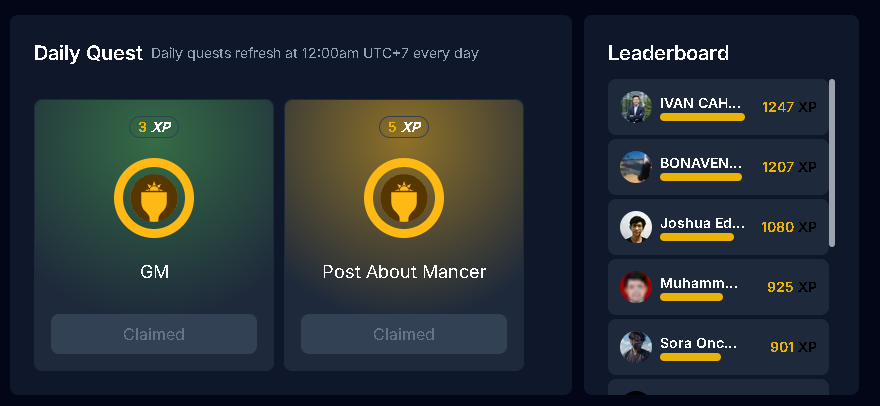
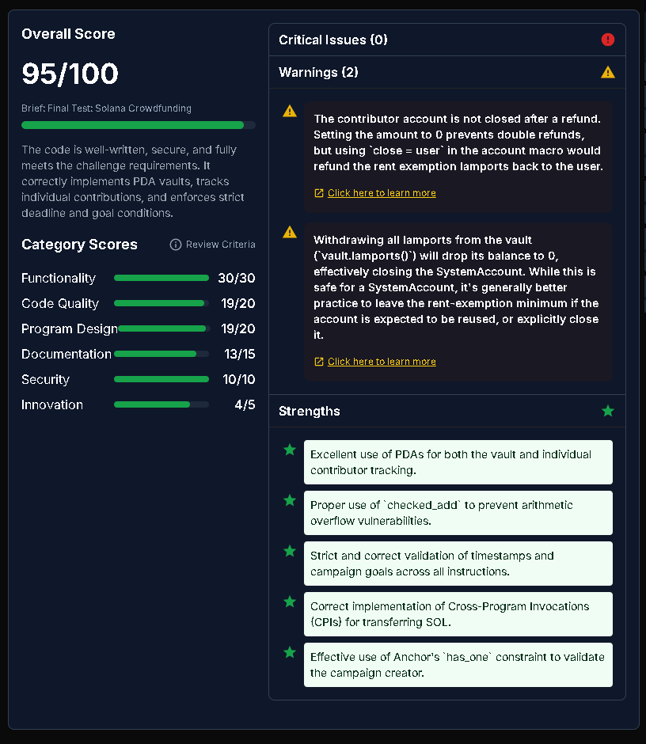
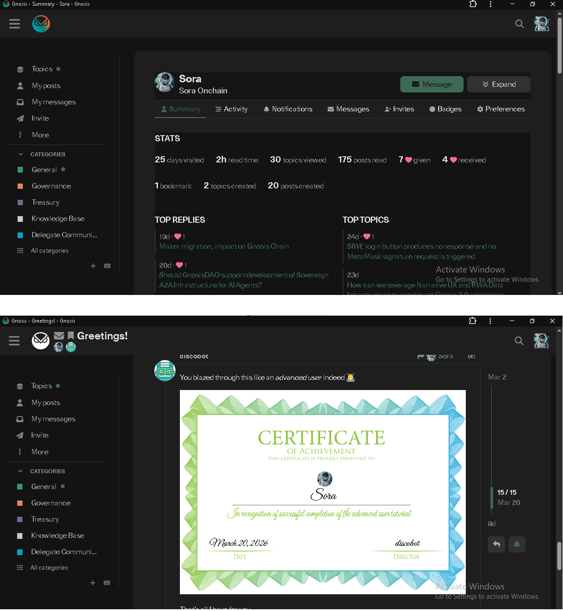
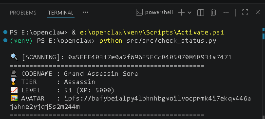
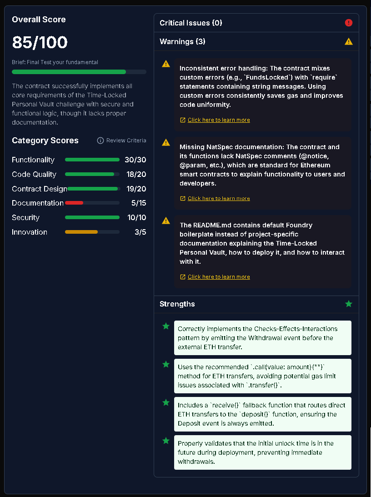
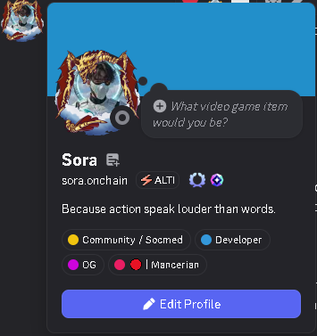
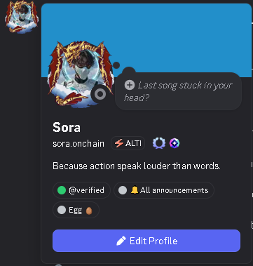

# 🏛️ SORA | Web3 Architect & Narrative Conceptualist

Exploring the intersection of **AI Agents**, **Agentic Economy**, and **Productive RWA** through architecture-led experimentation.

> *"Clarity before complexity. Infrastructure before intelligence. Proof before scale."*

---

## 🏆 Academic & Governance Proof of Work

### Mancer x Superteam Indonesia: Web3 Career Scholarship (Phase 1 Winner)

  
  

- **Status:** `PHASE 1 QUALIFIED` 🏅
- **Technical Excellence:** Perfect scores in **Security (10/10)** and **Functionality (30/30)** on the Solana Final Test.

### GnosisDAO Governance & Contribution

  

- **Active Governance:** Contributor to GnosisDAO forums, focusing on **AI Agent Infrastructure (A2A)** and **RWA Data Layers**.
- **Certified Expertise:** Successfully completed the Gnosis Advanced User tutorial (on-chain verification pending).

---

## 🧪 The Agentic Lab: "The Great Nine"
*A centralized workspace for documenting decentralized coordination and autonomous execution.*

### 🥷 ASSASSIN (Observability & Identity)

  

- **Status:** `DEPLOYED & LIVE` (Genesis Identity Minted 👤)
- **Network:** [Gnosis Chiado](https://gnosis-chiado.blockscout.com/)
- **Identity Proof:** [`Grand_Assassin_Sora`](https://gnosis-chiado.blockscout.com/tx/0xfc3a6e25822bbe1629670ae1ead88297c9057e3a73acc0e01876f5b2c38260d2)

### 🔒 Time-Locked Vault (EVM Security)

  

- **Audit:** **30/30 Functionality** | **10/10 Security**. Developed using Foundry.

### 🐎 Vanguard (Active RWA Agent)
- **Identity:** [`vanguard.openclaw.gno`](https://gnosis-chiado.blockscout.com/address/0xCE7879A11b8b5015D5f40837114683b612579F54)
- **Mission:** Bridging equestrian biometrics with autonomous on-chain narrative.

---

## 👥 Community Reputation & Verified Roles

  
  

- **Mancerian OG:** Secured the prestigious **OG Role** within the Mancer ecosystem, recognizing early contribution and technical proficiency.
- **Discord Footprint:** Actively engaged in high-level technical discussions across Gnosis and Solana community hubs.

---

## 🛡️ Case Study: Angelica v3.1 - Autonomous Trading Agent
**Infrastructure-as-Code & Agentic Workflows**

A high-fidelity implementation of an autonomous agent designed to navigate the Hyperliquid ecosystem. This project demonstrates the bridge between architectural design and persistent, cloud-native execution.

### 🔑 Key Architectural Features
- **Cloud-Native Persistence:** Migrated from local execution to **Railway.app (Singapore Data Center)**, achieving 24/7 uptime and sub-100ms latency to exchange endpoints.
- **Agentic Intelligence:** Powered by **Groq LPU Inference**, allowing the agent to perform real-time narrative and trend analysis on high-volatility assets (HYPE, DYDX).
- **Secure CI/CD Pipeline:** - Automated deployment via GitHub Actions/Railway triggers.
    - Zero-trust environment variable management (no physical `.env` files in production).
    - Hardened `.gitignore` protocols for private key protection.
- **Protocol Integration:** Built on the **CCXT** framework for standardized exchange interaction and **Python-Dotenv** for modular configuration.

### 📈 Operational Parameters
- **Market Screening:** 24-hour rolling window trend analysis.
- **Decision Engine:** LLM-based sentiment and technical data synthesis.
- **Risk Management:** Automated position monitoring and one-cycle patching for secure execution.

> *“Clarity in architecture leads to security in execution.”* — Deployed March 2026.

### 🔗 Evidence & Verification
- **Codebase:** [angelica-autonomous-agent](https://github.com/soraonchain-byte/angelica-autonomous-agent) *(Private Access)*
- **On-Chain Activity:** [Hyperliquid Explorer - Wallet Address](https://stats.hyperliquid.xyz/address/MASUKKAN_WALLET_ADDRESS_ANDA_DI_SINI)
- **Deployment Status:** 

> *“Clarity in architecture leads to security in execution.”* — Deployed March 2026.

## 🔬 Experimental Frameworks
- **SVM Mastering:** Anchor, PDAs, and Cross-Program Invocations (CPIs).
- **EVM Mastering:** Foundry, Checks-Effects-Interactions (CEI), and Gas Optimization.

---

## 👤 Identity & Digital Footprint
- **Twitter:** [@SoraOnchain](https://x.com/SoraOnchain)
- **Basename:** `soraonchain.base.eth`

---

  

